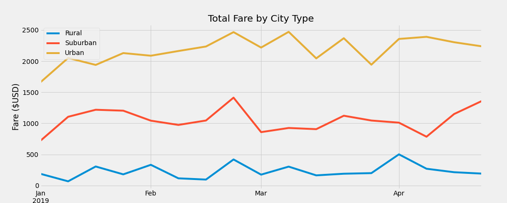
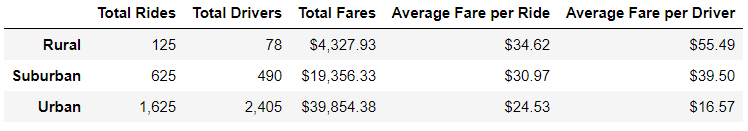

# PyBer Analysis

## Overview of Project
The purpose of this analysis is to display summary information about ride-sharing data by city type (Rural, Suburban, and Urban). After reviewing this summary, the reader will know...
- Total rides given within each city type during the 2019 year
- The number of drivers within each city type
- Total fares earned in each city type
- The average fare given per ride within a particular city type
- The average fare given per driver within a particular city type

Further, the reader will have a glimpse of how total fares were earned between each city type throughout the first four months of 2019. 

## Results

Looking at the first four months of 2019, here's how Total Fares measured out between the city types.

Here is the summary of our ride-share data throughout 2019 based on city type. 

As you see, it seems that the Urban cities have the highest amount of volume in terms of rides, drivers, and total fares, while having the lowest average fares per ride and driver. The Suburban areas were pretty middle of the road in terms of volume and averages. Finally, the rural areas were the opposite extreme of the Urban cities - they had the lowest volume between rides, drivers and total fares, but had the highest average fares for both ride and driver.  

## Summary

Upon review of these results from last year, we see extremes represented between the urban and rural cities while suburban cities remained very "middle of the road" pardon the pun, in terms of categories discussed. For strategies to employ going forwards, here's are some recommendations that I would like to provide:

#### 1) Urban Cities are Oversaturated with Drivers
Our summary shows that there were 1,625 rides provided for 2,405 available drivers. We had nearly 50% more drivers than we had rides available for them during 2019. This led to a decent amount of down time for our drivers. This, in conjunction with low fare averages, this may discourage future driver participation on our platform. I propose that in urban areas, we reduce the rate at which drivers are onboarded to our platform. In conjunction with this, also encourage rider awareness and have them use PyBer as their ideal means of transportation in getting around their city. 

#### 2) Rural Cities are Undersaturated with Drivers
The opposite shows within Rural areas. There were nearly 50% more rides than we had drivers available during 2019. Existing drivers from urban/suburban areas should be encouraged to take more rural based fares - the money is there as seen by the average fare comparisons! However, to get to a rural area may take considerably more resources from our drivers. To offset this, we may need to offer a bit of a padded fare surcharge to the rider if the driver is travelling a significant distance to entertain the fare. This should be the case until user adoption in rural areas increase. The fare surcharge would not come at the expense of the rider, but at the expense of PyBer to not scare off riders with increased fare rates for the already lengthier distances they tend to travel (based solely on average fare per ride). 

#### 3) Encourage User adoption in Suburban and Rural areas 
Throw new-user promotions within the Suburban and Rural areas where the company provides the rider with a fare reduction for their first 5-10 rides. This will encourage use, then over time, with more users on the PyBer platform, it may also better encourage drivers to be more readily available in these areas to assist with the potentially increased demand. We see here, Urban cities had 2.5 times more rides than Suburban cities and 13 times more rides than Rural cities! The volume has to shift from being Urban focused to providing consistent service and experience for all regions. Targeting special events in these lower volume city types with these promotions may go a long way in getting more users in the know and in love with PyBer. 
